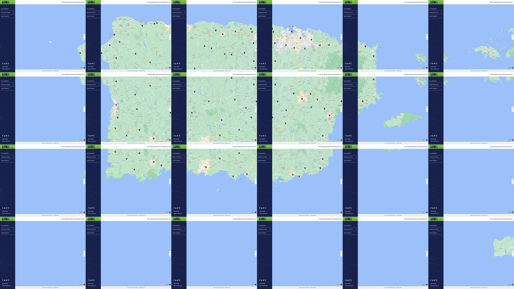

# Power_nodes_crawling

The data is gathered on https://miluma.lumapr.com/outages/outageMap

Enter following command to Terminal to run the code
```bash script
python run.py
```

The route for the screen can be visualized:


